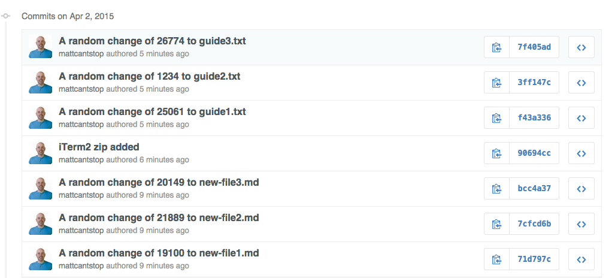

# filter-branch-example
example of filtering a branch to remove a large binary asset commit

**Warning from Git Docs Concerning Filter Branch:**
WARNING! The rewritten history will have different object names for all the objects and will not converge with the original branch. You will not be able to easily push and distribute the rewritten branch on top of the original branch. Please do not use this command if you do not know the full implications, and avoid using it anyway, if a simple single commit would suffice to fix your problem. 

Performing this action rewrites the commit history. I needed to do a `force push` to push my repo to origin after performing this action. These actions (both force pushes and filter-branch) are dangerous actions to perform when working with other people. Their history and origin's history will diverge if you use these operations. 

If you use `force push` you may also be removing commits they recently made from master. Extreme caution should be used and coordination with other team members is a must.

### Steps Taken to Remove Large File
1. Created repo
2. Added three files and committed
3. Added iTerm2 zip file (large file to be removed)
4. Added three more commits
5. Executed a `filter-branch` command. Here it is:
  - ```
    git filter-branch --force --index-filter \
    'git rm --cached --ignore-unmatch iTerm2_v2_0.zip' \
    --prune-empty --tag-name-filter cat -- --all
    ```
6. After git rewrites history and removes iTerm2 file I force pushed my repository to origin and all traces of the iTerm2 file were gone. 

**Commit History on Origin with Binary Included Before Filter-Branch**



**Commit History After Filter Branch (Step 5 Above) Was Executed:**


[Simple Filter Branch Demo](https://help.github.com/articles/remove-sensitive-data/) at GitHub in the context of removing sensitive data, but the process is the same for a large binary asset.
